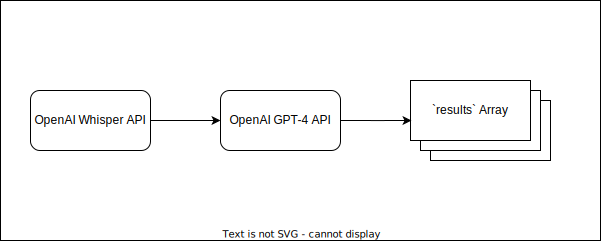

# RambleReducingRefiner (R3)

Most of my life is based around knowledge work, and the processes of thinking. Most of my best thinking isn't done at my desk, so I frequently talk through problems in my own head while walking, or doing other physical tasks away from a screen.

This project was an experiment at capturing some of my thoughts by recording things I've talked to myself about in an audio file, and distilling the key points.

## Architecture

Project is built on Python 3.11, and utilizes the OpenAI API's to access the Whisper (Audio Transcription) and GPT-4 (LLM) models.

The primarily limit of the app in it's current form is the 16k tokens used in the GPT-4 model (available in private beta). It cannot handle large transcripts from long-running recordings. My average speech rate when talking to myself is about 80WPM (weird fact, I know). Assuming a conversion of words:tokens of 0.66, that gives at least two hours of conversation in a single run.

## Running R3

1. Clone the repository.
2. Setup the necessary modules using `pip`.
3. Run the script using `./python r3.py recording.mp3`.